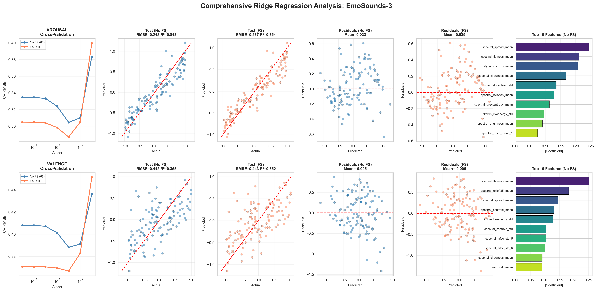
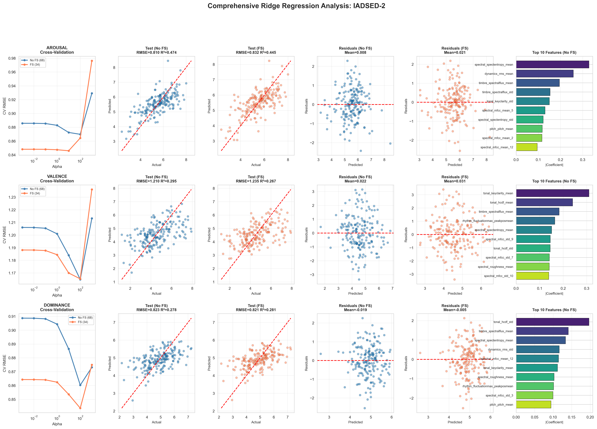
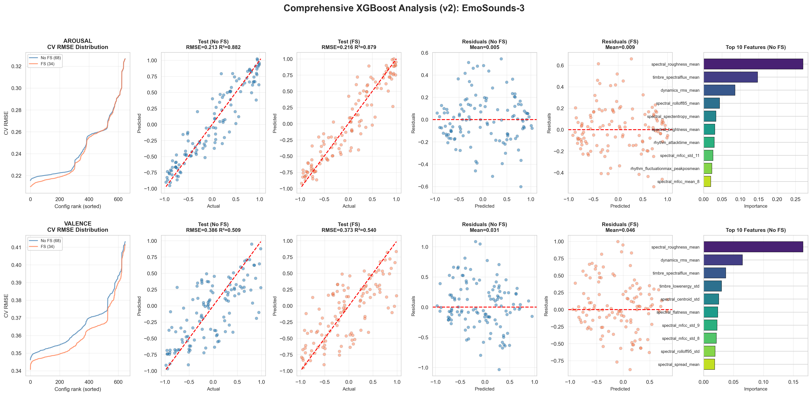
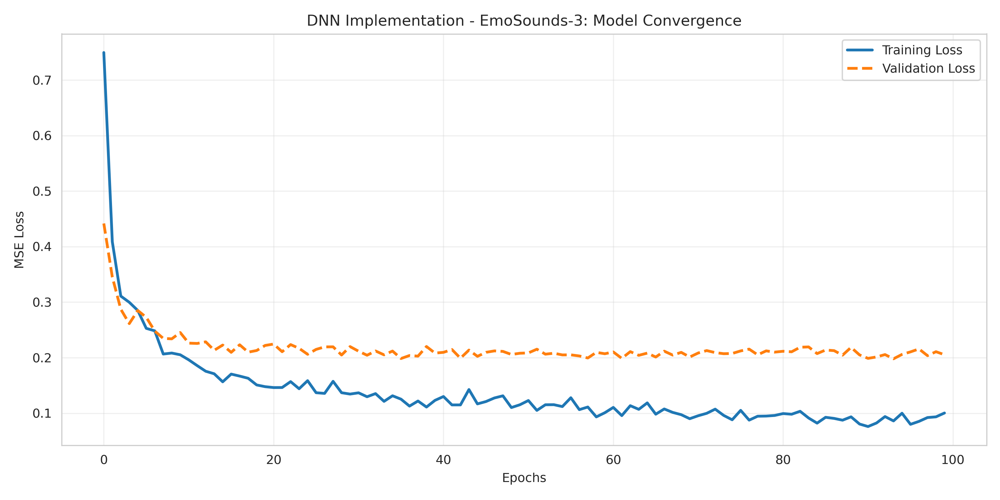
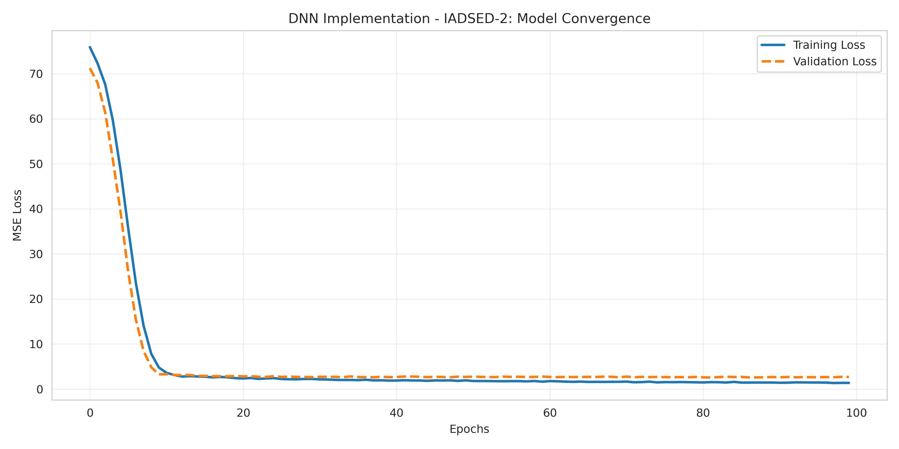
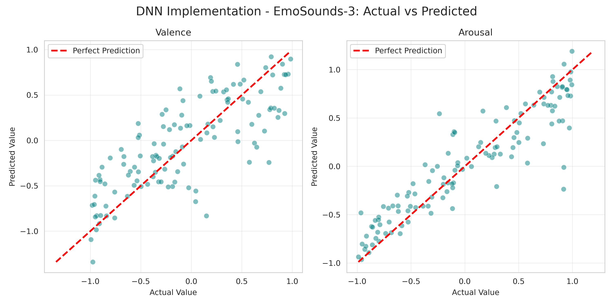
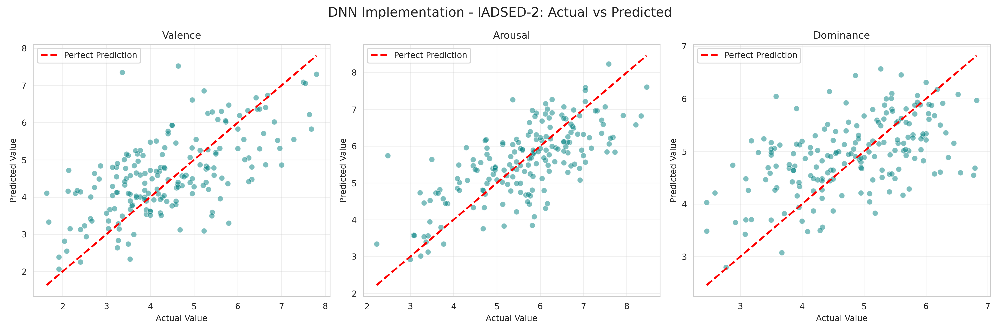

# CS273-HW1: Emotion Prediction from Audio Features

Multi-task regression analysis to predict emotional dimensions (arousal, valence, dominance) from audio features using machine learning models.

**Final Report**: [View on Overleaf](https://www.overleaf.com/read/djwxshnxvwbv#599c7a)

---

## Datasets

**EmoSounds-3** and **IADSED-2** — audio datasets with emotional ratings across three dimensions:
- **Arousal**: Energy level (calm to excited)
- **Valence**: Pleasantness (negative to positive)
- **Dominance**: Control level (submissive to dominant)

### Data Distribution

 

---

## Models Implemented

1. **Ridge Regression** — Linear model with L2 regularization
2. **XGBoost** — Gradient boosted decision trees
3. **Deep Neural Network (DNN)** — Multi-task learning with shared layers

All models use:
- 5-fold cross-validation for hyperparameter tuning
- Varied Feature selection 
- Varied Train/validation/test split

---

## Results

### Ridge Regression Performance


<details>
<summary>Dataset-specific analysis</summary>
 
</details>

### XGBoost Performance


<details>
<summary>Dataset-specific analysis</summary>
 
</details>

### Deep Neural Network Performance

 

 

---

## Setup & Usage

### Installation

```bash
pip install -r requirements.txt
```

### Running the Analysis

**Data Preprocessing:**
```bash
cd Data
python data_preprocessing.py
```

**Ridge Regression:**
```bash
cd Ridge
python ridge_regression_analysis.py
```

**XGBoost:**
```bash
cd Xgboost
python xgboost_analysis.py
```

**Deep Neural Network:**
```bash
cd DNN
python dnn.py
```

---

## Project Structure

```
CS273-HW1/
├── Data/                    # Raw and preprocessed datasets
│   ├── data_preprocessing.py
│   ├── EmoSounds-3.csv
│   ├── IADSED-2.csv
│   └── *_preprocessed.csv
├── Ridge/                   # Ridge regression implementation
├── Xgboost/                 # XGBoost implementation
├── DNN/                     # Deep neural network implementation
└── requirements.txt
```
